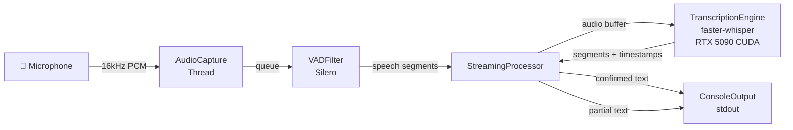
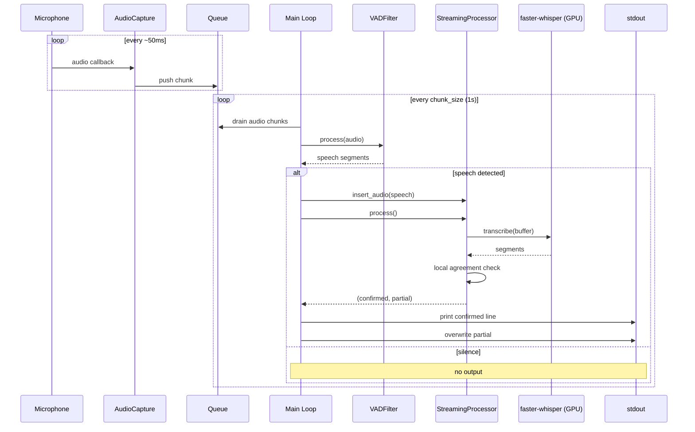
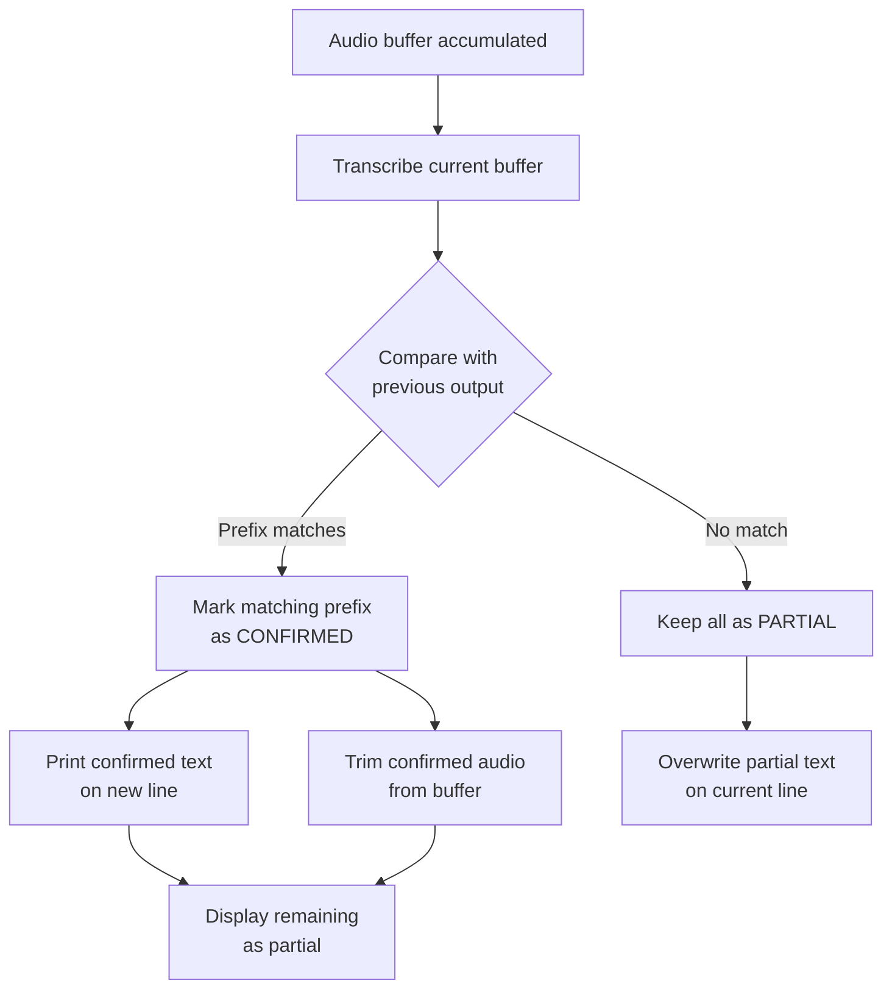
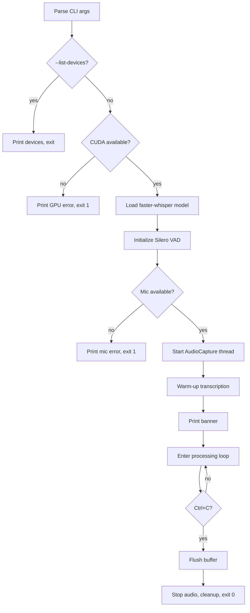

# SPEC001 - Diagrams

## 1. System Data Flow

```mermaid
flowchart LR
    MIC[🎤 Microphone] -->|16kHz PCM| AC[AudioCapture\nThread]
    AC -->|queue| VAD[VADFilter\nSilero]
    VAD -->|speech segments| SP[StreamingProcessor]
    SP -->|audio buffer| TE[TranscriptionEngine\nfaster-whisper\nRTX 5090 CUDA]
    TE -->|segments + timestamps| SP
    SP -->|confirmed text| CO[ConsoleOutput\nstdout]
    SP -->|partial text| CO
```

## 2. Processing Loop Sequence

```mermaid
sequenceDiagram
    participant Mic as Microphone
    participant AC as AudioCapture
    participant Q as Queue
    participant Main as Main Loop
    participant VAD as VADFilter
    participant SP as StreamingProcessor
    participant FW as faster-whisper (GPU)
    participant Out as stdout

    loop every ~50ms
        Mic->>AC: audio callback
        AC->>Q: push chunk
    end

    loop every chunk_size (1s)
        Main->>Q: drain audio chunks
        Main->>VAD: process(audio)
        VAD-->>Main: speech segments

        alt speech detected
            Main->>SP: insert_audio(speech)
            Main->>SP: process()
            SP->>FW: transcribe(buffer)
            FW-->>SP: segments
            SP->>SP: local agreement check
            SP-->>Main: (confirmed, partial)
            Main->>Out: print confirmed line
            Main->>Out: overwrite partial
        else silence
            Note over Main,Out: no output
        end
    end
```

## 3. Local Agreement Policy

```mermaid
flowchart TD
    A[Audio buffer accumulated] --> B[Transcribe current buffer]
    B --> C{Compare with\nprevious output}
    C -->|Prefix matches| D[Mark matching prefix\nas CONFIRMED]
    C -->|No match| E[Keep all as PARTIAL]
    D --> F[Print confirmed text\non new line]
    D --> G[Trim confirmed audio\nfrom buffer]
    E --> H[Overwrite partial text\non current line]
    F --> I[Display remaining\nas partial]
    G --> I
```

## 4. Startup Sequence

```mermaid
flowchart TD
    A[Parse CLI args] --> B{--list-devices?}
    B -->|yes| C[Print devices, exit]
    B -->|no| D{CUDA available?}
    D -->|no| E[Print GPU error, exit 1]
    D -->|yes| F[Load faster-whisper model]
    F --> G[Initialize Silero VAD]
    G --> H{Mic available?}
    H -->|no| I[Print mic error, exit 1]
    H -->|yes| J[Start AudioCapture thread]
    J --> K[Warm-up transcription]
    K --> L[Print banner]
    L --> M[Enter processing loop]
    M --> N{Ctrl+C?}
    N -->|no| M
    N -->|yes| O[Flush buffer]
    O --> P[Stop audio, cleanup, exit 0]
```
